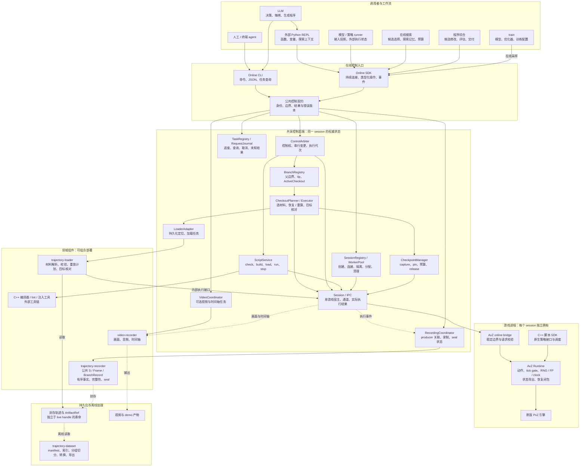
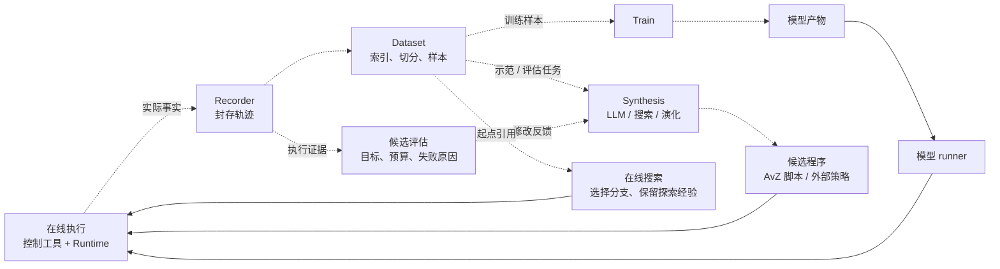
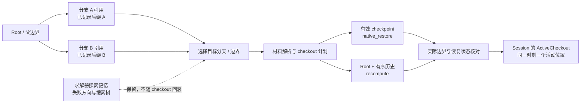

# pvz-agent-lab 设计文档索引

状态：设计草稿。以 AvZ Runtime 与在线控制工具为共同底座。人工、LLM、模型 runner、在线搜索与程序综合使用同一套 CLI/SDK；训练和数据集工具消费执行记录。

项目将实现快速恢复 fork（相对于历史长度近似 O(1)）和重算 fork（相对于历史执行工作量 O(n)）。原生实现归 AvZ，在线后端编排 checkout，loader 解析持久化材料；复杂度不表示功能已实现，也不承诺任意轨迹冷加载为 O(1)。

## 详细架构图

实线表示调用或控制，虚线表示执行事实、产物或离线数据流。共享后端框表示资源与语义的统一归属，不要求组件全部在同一进程；图中的职责名称不是已经冻结的 API。

## 组件职责与状态归属

| 层 / 组件 | 拥有的状态或产物 | 调用与输出 | 生命周期 / 共享约束 |
|---|---|---|---|
| CLI | 命令参数与单次调用结果 | 公共控制契约、JSON / 诊断 | 命令退出不关闭长期 session |
| SDK / REPL | 客户端连接；REPL 变量与函数 | 类型化请求、任务、事件 | REPL 状态不自动随游戏回退 |
| 会话注册与 worker 池 | session 身份、宿主分配与隔离资源 | 创建、连接、关闭多个游戏宿主 | 多 session 可并行，每个宿主独立 Runtime |
| 控制权与请求仲裁 | 写拥有者、控制模式、排队请求、代次 | 稳定边界验证、串行变更 | 同 session 多客户端共用权威状态 |
| 分支引用管理 | 父边界、已确认 tip、活动位置 | 创建引用、查询、提交 checkout 目标 | 创建分支不自动复制游戏或捕获状态 |
| Checkout 编排 | 恢复计划、执行进度、目标核对 | live restore、artifact 加载、root/history 重算 | 成功后发布活动状态，部分失败阻止继续变更 |
| Checkpoint 管理 | live 材料引用、pin、预算与兼容范围 | 捕获、释放、缓存驱逐 | 分支存在不保证 checkpoint 仍有效 |
| 脚本服务 | 源码/构建身份、装载版本、脚本任务 | 编译器 / lint / 注入工具与 Runtime | 编译、装载、运行分别报告 |
| 任务与请求日志 | 实际进度、结果、错误、保留窗口 | 查询、等待、取消、重连 | 取消请求不等于执行已停止 |
| 录制协调 / recorder | 流关联 / 公共记录与 seal | Runtime 事实、FrameRef、ArtifactRef | 执行成功、写入成功、封存成功分开 |
| 加载适配 / loader | 加载任务 / 持久化解析与重放计划 | 显式材料引用、内部执行接口 | 不查询 dataset 筛选策略，不递归 checkout |
| 视频协调 / video | 可选任务、输出与时间轴 | 画面、音频、媒体产物 | 不承担状态恢复，不自动回滚 |
| AvZ Runtime / C++ SDK | 游戏内状态、调度、恢复闭包 | 原生动作、受控更新、状态与 receipts | 每个 session 一份，支持范围显式声明 |
| dataset | manifest、索引、切分与样本 | 离线读取封存记录、输出数据 | 无需游戏或在线服务 |
| train | 模型、优化器、训练记录 | dataset 与可选在线采样 | 模型 checkpoint 与游戏 checkpoint 分开 |
| search/synthesis | 候选、探索记忆、评估与程序产物 | SDK 执行实验、dataset 提供历史证据 | 决定搜索方向，不实现 checkout 机制 |

## 数据、训练与程序开发闭环

运行依赖与开发反馈分别绘制，避免把产物生成误读为训练模块直接控制游戏。下图的“在线执行”可使用原生脚本路径或外部 SDK 路径。

## Git 类比与分支执行

session 类似 worktree，逻辑分支类似 branch ref，ActiveCheckout 类似 HEAD 与实际工作区的绑定。关键区别是目标必须经过真实恢复或重算才能成为活动状态。

分支引用、轨迹事实和恢复材料分别管理；删除引用不自动删除证据，释放 checkpoint 不删除历史。游戏状态没有通用 merge/rebase 操作。详见[对象与分支引用](avz/backend/01_对象与分支引用.md)、[checkout 流程](avz/backend/02_Checkout与恢复编排.md)和[任务与资源生命周期](avz/backend/03_任务记录与资源生命周期.md)。

## 阅读顺序

1. [系统分层与模块边界](01_系统分层与模块边界.md)
2. [AvZ Runtime 与在线控制工具目录](avz/README.md)：Runtime、原生 SDK、CLI、在线 SDK/REPL、共享后端与内部 session。
3. [状态轨迹录制](04_状态轨迹录制_trajectory-recorder.md)
4. [轨迹加载与执行支路](05_轨迹加载与执行支路_trajectory-loader.md)
5. [视频与演示录制](06_视频与演示录制_video-recorder.md)
6. [可选模型与 LLM runner](07_模型交互与动作循环_agent-loop.md)
7. [轨迹数据集离线管理](08_轨迹数据集管理_trajectory-dataset.md)
8. [训练方案与配置](09_训练方案与配置_train.md)
9. [搜索与程序综合](10_搜索与程序综合_search-synthesis.md)

## 组件索引

| 文档 / 组件 | 关注内容 |
|---|---|
| [AvZ Runtime / 原生脚本 SDK](avz/01_Runtime与原生脚本SDK.md) | 游戏内动作、调度、确定性、原生状态导出与恢复 |
| [在线 CLI](avz/02_在线CLI.md) | 终端命令、结构化结果、脚本工具链与任务入口 |
| [在线 SDK / REPL](avz/03_在线SDK与REPL.md) | 可编程客户端、外部解释器和状态边界 |
| [共享控制后端](avz/04_共享控制后端.md) | session、branch/checkout、checkpoint、脚本任务及组件集成 |
| [内部 session](avz/05_session与执行契约.md) | 物理宿主、IPC、资源、执行代次与单动作契约 |
| trajectory-recorder | 公共记录 schema、执行事实、证据与封存 |
| trajectory-loader | 持久化解析、重放计划、目标核对与转换成本 |
| video-recorder | 可选视频、音频与时间轴 |
| 可选 runner | 模型、LLM 与工具交互 |
| trajectory-dataset | 离线索引、切分、转换与导出 |
| train | 模型开发与训练产物 |
| search/synthesis | 在线求解、程序开发、候选评估与交付 |

## 变更与交付

[CHANGELOG](CHANGELOG.md)记录架构变更、历史命名与文档路径迁移。[交付顺序与约束](交付顺序与约束.md)维护实现顺序。验收、testbench、负例与运行证据在相应 issue 中维护。

## 文档组织约定

总览与独立职责文档保留根目录编号；AvZ 原生能力与在线工具文档放在 `avz/`，目录内编号表达阅读顺序。目录与文档划分不强制独立仓库或同进程部署；原生 SDK 与 Runtime 属于同一 AvZ fork。README 维护统一索引，正文描述当前目标架构，历史变化集中在 CHANGELOG。
