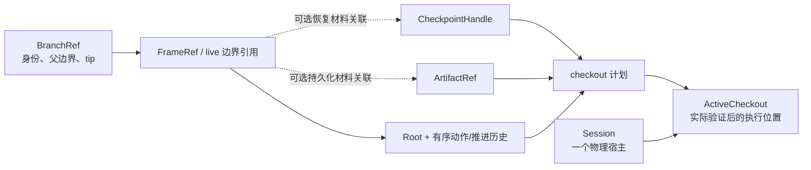

# 后端对象与分支引用

后端维护执行资源与逻辑分支的引用关系；recorder 拥有持久化事实格式。以下是设计对象与不变量，不是已冻结的 API 名称。

## 对象模型

| 对象 | 内容与所有者 | 生命周期与约束 |
|---|---|---|
| Session | 后端拥有的游戏进程、Runtime、通道与隔离资源 | 一个 session 同时只有一个活动执行位置；显式关闭或声明的清理策略释放 |
| RootRef | 初始化 recipe 或受支持的恢复材料及兼容版本 | 有身份不等于可重建；必须能解析到实际材料 |
| BranchRef | 逻辑分支身份、父边界与已确认 tip 引用 | 不等于进程或 checkpoint；可有历史但尚未物化到 session |
| ActiveCheckout | session 当前绑定的分支、实际边界、控制模式和代次 | 由后端唯一维护；只有实际建立并验证成功才公布为可执行 |
| BoundaryRef | session、代次、tick、phase、state_version | 当前变更的并发校验令牌；恢复后旧代次令牌失效 |
| FrameRef | recorder 中某个已记录边界的身份 | 指向不可变事实；不是在线执行令牌或恢复材料 |
| CheckpointHandle | AvZ 实际捕获的恢复材料引用、所属 session、兼容范围 | 可被释放或失效；历史引用仍在不代表句柄仍有效 |
| ArtifactRef | 持久化材料的类型、内容身份、位置与完整性 | 导出/导入必须有能力声明；不能直接序列化 live handle 得到 |
| TaskRef / RequestId | 长任务身份与单次操作身份 | 与执行代次、结果和证据关联；结果保留窗口需要声明 |

BranchRef 是控制层的逻辑引用；BranchRecord 是 recorder 的父子证据记录。需要持久化的分支关系交给 recorder，不另建可覆盖历史的第二套轨迹格式。未录制的 live 探索可以使用后端内部边界引用，但对外返回持久化 FrameRef 时必须确实存在记录。

## 引用、材料与实例

同一边界可以没有 checkpoint、有一个 live checkpoint，或有可导入 artifact。释放 checkpoint 不删除轨迹事实；删除逻辑分支引用也不自动释放仍被其他引用或任务使用的恢复材料。

## 分支创建与 tip 更新

创建分支先登记目标父边界和身份，不隐含复制游戏进程、capture 或 checkout。若调用者请求创建并切换，后端将它们作为明确的复合任务执行并分别报告结果。

已有后继历史的分支回退到过去后，继续执行新的后缀默认形成新子分支，原后缀保持不可变。后端可让 active checkout 暂停在历史位置，但不能用新动作覆盖已有事实。是否支持命名 ref 重指向，需单独定义显式操作与审计记录。

分支 tip 仅随已确认的实际执行推进；命令提交、排队或超时不能提前更新 tip。记录落盘/封存结果单独报告，执行成功不等于记录已经持久化。

## 与 Git 的对应关系

| Git 概念 | 游戏控制中的类比 | 精确限制 |
|---|---|---|
| repository / object database | 一个实验范围的轨迹与 artifact 存储 | 存储格式由 recorder 及各 artifact producer 定义；后端不实现另一套 Git 对象库 |
| worktree | session 物理执行工作区 | session 拥有真实游戏进程，创建和销毁有成本 |
| branch ref | 逻辑分支及 tip 引用 | 创建引用不自动准备可执行状态 |
| HEAD / checkout | 当前 session 的 ActiveCheckout | 位置需经过恢复或重算，不能只改指针 |
| commit history | 不可变的状态/动作/推进证据历史 | API 的 commit(action) 是游戏动作提交，不是一次 Git 提交或轨迹封存 |
| checkout 的工作区物化 | checkpoint restore 或 root/history recompute | 首次物化可能昂贵；FrameRef 不自带完整快照 |
| 多 worktree | 多个 session/worker | 不默认支持 checkpoint 跨进程迁移 |
| garbage collection | checkpoint 缓存、任务与 artifact 的资源回收 | live 资源、不可变记录和持久化文件分别有保留策略 |
| merge / rebase / cherry-pick | 无通用等价操作 | 游戏状态不能自动合并；移植动作是新的执行实验，需校验状态与前置条件 |

Git 类比用于解释身份、历史与活动工作区。具体数据结构、命令名称与持久化机制按游戏执行需求设计。
