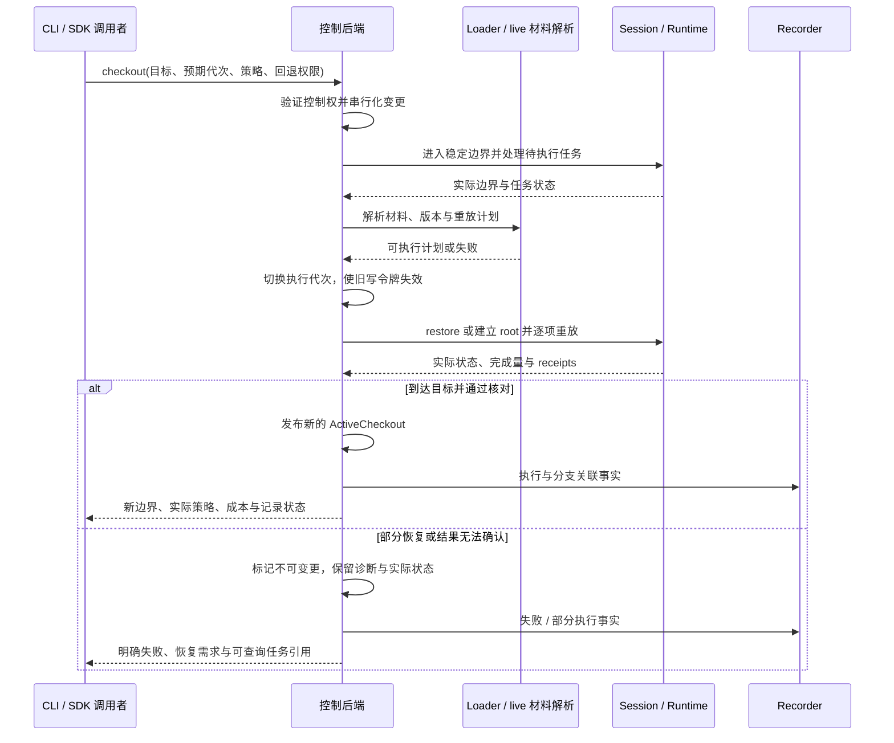

# Checkout 与恢复编排

checkout 将逻辑目标变成一个 session 中已确认的活动执行状态。它同时处理资源所有权、恢复计划、执行代次和证据关联，不只是修改当前分支指针。

## 输入与计划

请求包含目标分支/边界、目标 session 或新 worker 策略、预期当前代次、控制权、fork_strategy 和 fallback_policy。目标可以来自 live 探索或持久化轨迹，两种来源均可能使用恢复或重算。

| 可用材料 | 计划 | 成本与前置条件 |
|---|---|---|
| session 已在目标状态且兼容 | 验证位置，建立所需分支关联 | 无历史重放；仍检查控制状态及预期边界 |
| 同 session 的有效 checkpoint | native_restore | 相对于历史长度近似 O(1)；仍有复制/重建与校验成本 |
| 兼容的持久化 checkpoint artifact | loader 解析、导入与恢复 | 仅 Runtime 支持时可用，另计读取与完整性校验 |
| 可重建 root + 有序历史 | recompute | 初始化加 O(n) 执行工作量，核对记录状态 |
| 较早 checkpoint + 短后缀 | restore 后重算 k 步 | 恢复加 O(k)，明确报告混合计划 |
| 材料缺失、过期或不兼容 | 拒绝，或执行显式允许的回退 | 不静默改变策略，不把 S 当成完整恢复材料 |

规划器可使用已有缓存降低恢复成本，但只能选择调用者允许的路径。checkpoint 捕获、内存预算与驱逐由资源管理器执行；搜索器决定探索目标与搜索预算。

## 执行流程

具体失败时机需区分：在变更前拒绝，且稳定状态确认未变化时，可继续使用原活动位置；一旦开始修改或结果未知，则不能继续公布原位置为有效。失败不承诺自动回滚。恢复、root 重建及脚本控制状态改变的代次更新由后端统一管理，并与 Runtime 的验证令牌同步。

loader 只在持久化材料需要解析时参与。它通过内部 session 执行接口完成重放与核对，不调用公共 checkout 入口形成递归；在线 live 计划由控制后端直接编排。

## 脚本与外部状态

进入 checkout 前暂停或停止脚本任务，明确处置待执行回调/调度队列。目标 checkpoint 必须覆盖受支持的游戏与 AvZ 脚本控制状态；脚本版本不兼容或未审计状态应拒绝恢复。

外部 Python/模型策略状态由 runner 按契约恢复、重建或声明无状态。后端返回游戏 checkout 的成功不自动证明外部程序恢复成功；调用方须完成自己的状态建立后才继续决策。探索记忆可保留，视频与 LLM 上下文不自动回滚。

## 并发与取消

同 session 内变更串行，其他客户端不能在 checkout 中插入动作。只读请求返回已确认稳定状态及代次，或明确表示正在切换；不暴露执行中间态为正常 observation。

取消请求在可安全确认的边界处理，报告已完成重放量与实际状态。超时或断线时客户端查询 TaskRef/RequestId，不自动重复 checkout；旧代次请求在产生副作用前拒绝。
